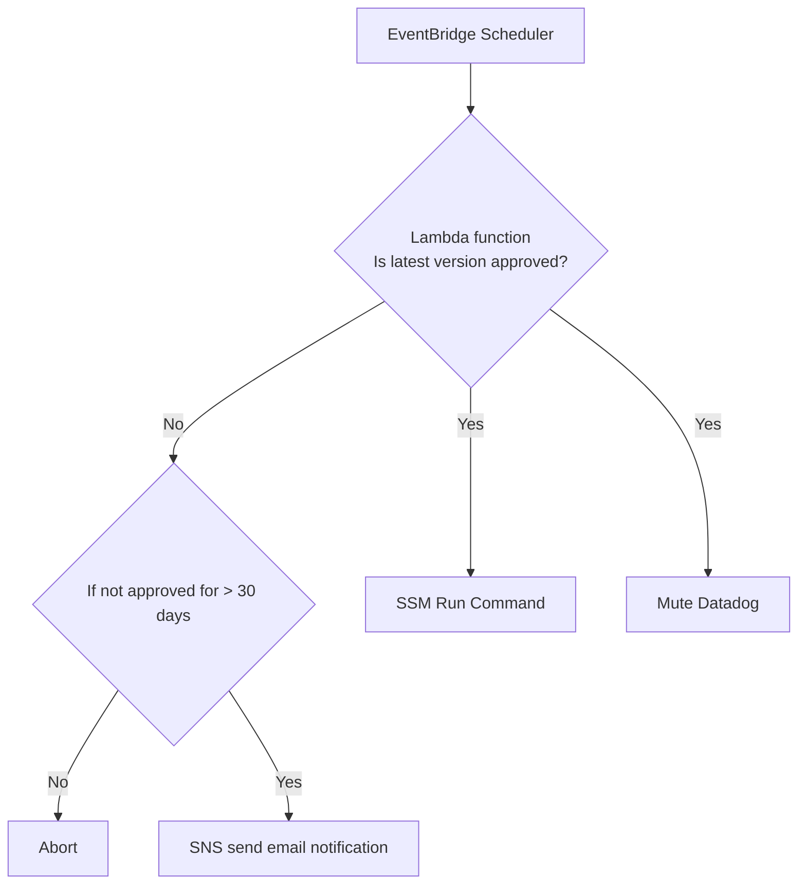

# FED-###: Automated deployment of Datadog agents onto customer EC2 servers


# Overview

The purpose of this solution is to automatically deploy the latest version of the Datadog agent to EC2 instances in a testing account and the penultimate version of the Datadog agent to EC2 instances in all customer accounts.

# Architecture


As shown in the diagram above, this solution is primarily comprised AWS Services.  The list below shows all of the solution components:

* AWS EventBridge Scheduler
* AWS Lambda Function
* AWS Athena
* AWS Glue
* AWS S3
* AWS Simple Notification Service (SNS)
* AWS Systems Managager (SSM)
* Datadog

## High-level Solution Workflow



1. EventBridge Scheduler is configured to trigger the Lambda function every Saturday at 7 am UTC.

2. Lambda function will perform these tasks:​

    - Execute Athena/Glue SQL query of CSV object (version-approvals.csv) in S3 bucket​

    - If latest version not approved then check age of CSV object (version-approvals.csv) in S3 bucket and if older than 30 days send SNS notification to NOC team​

    - If latest version is approved then mute Datadog and trigger SSM Run Command​

3. SSM Run Command will install penultimate version of agent on customer EC2 instances and latest version of agent on Staging Patch EC2 instances.​

## Importance of the version-approvals.csv file

The NOC team has complete control of when agent upgrades occur via the version-approvals.csv file.  If the CSV file looks something like this:

```
Version,Approved
7.63.3,No
7.63.2,Yes
7.63.1,Yes
7.63.0,Yes
7.62.3,Yes
7.62.2,Yes
```

then nothing will happen because the latest version is not approved.  However, if the CSV file looks something like this:

```
Version,Approved
7.63.3,Yes
7.63.2,Yes
7.63.1,Yes
7.63.0,Yes
7.62.3,Yes
7.62.2,Yes
```

then the agent upgrade will occur because the latest version is approved.

Therefore, whenever the NOC team wants an automated upgrade to occur they should upload a new, properly formated, `version-approvals.csv` to the `noc-athena-bucket` and then the next time EventBridge
triggers the Lambda function the Datadog agents will be upgraded.

# Setup

This section explains any components that require a substantial setup.

## AWS Credential Profiles Setup required by Terraform for multi-account installation of SSM Document

In order for this Terraform module to provision the AWS SSM Document resource on every FedRAMP AWS account a AWS config file needs to be created that works with AWS Identity Center.
At the time this document was written there were ten FedRAMP AWS accounts and the following is the `~/.aws/config` required for these accounts:

```
[default]
sso_session = fedramp-session
region = us-east-1
output = json

[sso-session fedramp-session]
sso_region = us-east-1
sso_start_url = https://d-9067d80a1d.awsapps.com/start
sso_registration_scopes = sso:account:access

[profile fedramp-agencysim-npri]
sso_session = fedramp-session
sso_account_id = 438979369891
sso_role_name = AdministratorAccess
region = us-east-1
output = json

[profile fedramp-edge-nw-npr]
sso_session = fedramp-session
sso_account_id = 491085412189
sso_role_name = AdministratorAccess
region = us-east-1
output = json

[profile fedramp-edge-nw-npri]
sso_session = fedramp-session
sso_account_id = 761018876945
sso_role_name = AdministratorAccess
region = us-east-1
output = json

[profile fedramp-edge-nw-prd]
sso_session = fedramp-session
sso_account_id = 120569617426
sso_role_name = AdministratorAccess
region = us-east-1
output = json

[profile fedramp-integration-npr]
sso_session = fedramp-session
sso_account_id = 686255941416
sso_role_name = AdministratorAccess
region = us-east-1
output = json

[profile fedramp-integration-npri]
sso_session = fedramp-session
sso_account_id = 311141548321
sso_role_name = AdministratorAccess
region = us-east-1
output = json

[profile fedramp-integration-prd]
sso_session = fedramp-session
sso_account_id = 528757785295
sso_role_name = AdministratorAccess
region = us-east-1
output = json

[profile fedramp-k8s-npr]
sso_session = fedramp-session
sso_account_id = 054037137415
sso_role_name = AdministratorAccess
region = us-east-1
output = json

[profile fedramp-k8s-npri]
sso_session = fedramp-session
sso_account_id = 202533508444
sso_role_name = AdministratorAccess
region = us-east-1
output = json

[profile fedramp-k8s-prd]
sso_session = fedramp-session
sso_account_id = 816069130447
sso_role_name = AdministratorAccess
region = us-east-1
output = json

[profile fedramp-network]
sso_session = fedramp-session
sso_account_id = 445567083790
sso_role_name = AdministratorAccess
region = us-east-1
output = json

[profile fedramp-security]
sso_session = fedramp-session
sso_account_id = 980921753767
sso_role_name = AdministratorAccess
region = us-east-1
output = json

[profile fedramp-tools-npri]
sso_session = fedramp-session
sso_account_id = 897722679597
sso_role_name = AdministratorAccess
region = us-east-1
output = json

[profile fedramp-tools-prd]
sso_session = fedramp-session
sso_account_id = 195665324256
sso_role_name = AdministratorAccess
region = us-east-1
output = json

[profile fedramp-main]
sso_session = fedramp-session
sso_account_id = 418295679780
sso_role_name = SecurityAudit
region = us-east-1
output = json
```

## Steps to authenticate to AWS Identity Center

1.  Run this command from Linux CLI

```
aws sso login --sso-session my-session --use-device-code
```

2. It will output a URL that you need to put into you browser.  Something like:

```
https://d-90677c141c.awsapps.com/start/#/device?user_code=ZWSV-FKLQ
```

3.  Your browser should output something like this:


At this point you should be able to run an AWS CLI command on any of the FedRAMP AWS accounts.  For example:

```
aws s3 ls --profile go-noc-rd
```

The profile must match one of the the profile values in the AWS config file above.

## Lambda Function

The Lambda function is built from Python code that requires the Datadog requests package to make Datadog API calls to mute Datadog.  This Datadog requests package is put into a Lambda layer that is used by the Lambda function.

### How does the Lambda Function tell SSM on which EC2 Instances to install which Agent version

There a various ways to select which EC2 instances will have the Datadog Agent installed.  In this PoC I have used EC2 tags.  If an EC2 has the `dd_agent` tag with value of `latest` then the latest version found in the `version-approvals.csv` is installed
on that EC2.  However, if an EC2 has the `dd_agent` tag with value of `penultimate` then the penultimate version found in the `version-approvals.csv` is installed on that EC2.  In a production implementation we may want to change that to select based on the
AWS account number.


## Athena/Glue

Athena is used to make SQL calls of the version-approvals.csv file which is located in a S3 bucket.  In order for Athena to make SQL queries it requires a Glue Database and Table.  The Glue Table contains the schema of the version-approvals.csv file and this schema is used by Athena.

## Systems Managager (SSM)

A SSM Document is required that contains the logic to upgrade the Datadog agent on the EC2 instances.  AWS already provides a Datadog SSM Document to install the latest version of the Datadog agent on the EC2 instances.  I cloned that Document and then modified it to accept the passing of `agentmajorversion` and `agentminorversion`.  The code snippet below shows what I added to my custom Datadog SSM Document called **automated-datadog-agent-upgrade**

```json
{
  "schemaVersion": "2.2",
  "description": "Install, update, or remove the datadog agent.",
  "parameters": {
    "action": {
      "type": "String",
      "description": "(Required) InstallOrUpgrade or Uninstall",
      "default": "InstallOrUpgrade",
      "allowedValues": [
        "InstallOrUpgrade",
        "Uninstall"
      ]
    },
    "apikey": {
      "type": "String",
      "description": "(Required) Datadog API KEY"
    },
    "site": {
      "type": "String",
      "description": "(Optional) Specify the datadog site to use",
      "default": ""
    },
    "hostname": {
      "type": "String",
      "description": "(Optional) Specify the hostname",
      "default": ""
    },
    "tags": {
      "type": "String",
      "description": "(Optional) Specify a list of comma-seperated tags",
      "default": ""
    },
    "agentmajorversion": {
      "type": "String",
      "description": "(Optional) Specify the major version of the agent",
      "default": "7"
    },
    "agentminorversion": {
      "type": "String",
      "description": "(Optional) Specify the minor version of the agent",
      "default": ""
    }
  },
  "mainSteps": [
    {
      "action": "aws:runShellScript",
      "precondition": {
        "StringEquals": [
          "{{ action }}",
          "InstallOrUpgrade"
        ]
      },
      "name": "AgentInstallation",
      "inputs": {
        "runCommand": [
          "set -e",
          "INSTALL_SCRIPT_URL=https://s3.amazonaws.com/dd-agent/scripts/install_script_agent7.sh",
          "DD_API_KEY=\"{{ apikey }}\" DD_SITE=\"{{ site }}\" DD_HOST_TAGS=\"{{ tags }}\" DD_HOSTNAME=\"{{ hostname }}\" DD_AGENT_MAJOR_VERSION=\"{{ agentmajorversion }}\" DD_AGENT_MINOR_VERSION=\"{{ agentminorversion }}\" bash -c \"$(curl -L \"${INSTALL_SCRIPT_URL}\" | sed -e \"s|tool: install_script|tool: aws_run_command|g\" -e \"s|variant=install_script_agent7|variant=aws_run_command-6.0|g\")\"",
          "set +e"
        ]
      }
    },
    {
      "action": "aws:runShellScript",
      "precondition": {
        "StringEquals": [
          "{{ action }}",
          "Uninstall"
        ]
      },
      "name": "AgentRemoval",
      "inputs": {
        "runCommand": [
          "set -e",
          "if command -v \"apt-get\"; then apt-get remove -y datadog-agent",
          "elif command -v \"yum\"; then yum remove -y datadog-agent",
          "elif command -v \"dnf\"; then dnf remove -y datadog-agent",
          "elif command -v \"zypper\"; then zypper rm -y datadog-agent; fi",
          "set +e"
        ]
      }
    }
  ]
}
```

The SSM Run Command uses this SSM Document to upgrade the Datadog agents and record what it has done in the Run Command history.

# Infrastructure as Code (IaC) Deployment

This entire solution, including the GitLab project and pipeline, was deployed using Terraform.  One Terraform project ([GitLab Project IaC](https://gitlab.tecsysrd.cloud/briang/terraform/-/tree/main/gitlab/automated-agent-installation-repo?ref_type=heads)) was used to provision the GitLab project and pipeline and this, second Terraform project, was used to provision all the AWS Services.

The advantage of using Terraform to provision the GitLab project and pipeline was that the AWS Access Key, AWS Secret Access Key, Datadog API Key and Datadog APP Key need to be stored as GitLab CI/CD Environment variables and using
Terraform meant I could generate and save the AWS Access Keys and AWS Secret Access Keys during the `terraform apply` phase and I could get the  Datadog API Keys and Datadog APP Keys from AWS Parameter Store.  Overall using Terraform to
provision the GitLab project and pipeline meant it was easier and predictable to work with secrets.

# Testing

Once this solution is deployed it can be tested from the AWS Lambda console by going to the `query-athena-lambda` Lambda function and using the native **Test** functionality.


# Helpful commands

## How to get a list of Datadog agent versions

```
curl -s https://api.github.com/repos/DataDog/datadog-agent/releases | grep '"tag_name":' | sed -E 's/.*"([^"]+)".*/\1/' | sort -rV
curl -s "https://api.github.com/repos/DataDog/datadog-agent/releases" | jq -r '.[].tag_name' | sort -rV
```

## How to install a specific version of the Datadog agent

```
export DD_API_KEY=<MY_DATADOG_API_KEY>
export DD_AGENT_MAJOR_VERSION=7
export DD_AGENT_MINOR_VERSION=63.2
export DD_SITE="datadoghq.com"
bash -c "$(curl -L https://s3.amazonaws.com/dd-agent/scripts/install_script.sh)"
```

or

```
export DD_API_KEY=<MY_DATADOG_API_KEY>
export DD_AGENT_MAJOR_VERSION=7
export DD_AGENT_MINOR_VERSION=63.2
export DD_SITE="datadoghq.com"
bash -c "$(curl -L https://install.datadoghq.com/scripts/install_script_agent7.sh)"
```

## Setup of Lambda Layer

```
cd ~/terraform/aws/automated-agent-installation/modules/eb_lambda
mkdir -p python/lib/python3.12/site-packages
pip install requests -t python/lib/python3.12/site-packages
zip -r artifacts/requests-layer.zip python
```

# ToDo

## Create AWS IAM Role in each account that will be assumed by Lambda Function

Follow Mike's example in https://gitlab.tecsysrd.cloud/ops/noc/iam-keys-rotation-check to deploy IAM Roles in all AWS accounts.

## Modify SSM Document so that is it shared to all AWS accounts

## Modify Lambda Function to call SSM Document in all AWS accounts
