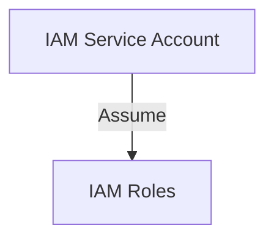

# IAM Setup for GitLab to Provision the Automated Datadog Agents Upgrade Solution

[](#)


# Overview

The purpose of this multi-account solution is to create the IAM Service Account (SA) and IAM Roles assumed by this SA so that a GitLab Pipeline in https://gitlab.tools.tecsysfed.cloud/noc/automated-datadog-agent-upgrade can provision the AWS resources required for the Automated Datadog Agents Upgrade Solution using Terraform.

# AWS Resources

This repo provisions an AWS IAM User Service Account (SA) and IAM Roles assumed by this SA.  The SA named `datadog-agent-upgrade-sa` is provisioned in the Security account by the `principal-iam` module and an IAM Role named `datadog-agent-upgrade-role-assumed` is provisioned in every other AWS accounts by the `targets-iam` module.  The SA is configured with IAM Policies that enable it to assume the `datadog-agent-upgrade-role-assumed` role in all other accounts and provision the AWS resources required by the Automated Datadog Agents Upgrade Solution solution, in the Security account.  The security credentials (AWS Access Key and AWS Secret Access Key) of the SA are configured as CI/CD variables in https://gitlab.tools.tecsysfed.cloud/noc/automated-datadog-agent-upgrade so that when the GitLab Pipeline runs it will authenticate as the SA.

## High-level Solution Workflow



## AWS SSO Config Profiles Setup required by Terraform for multi-account installation of SSM Document

In order for this Terraform module to provision the AWS resources in every FedRAMP AWS account an AWS config file needs to be created that has a profile for each AWS account that will work with AWS Identity Center.
At the time this document was written there were 13 FedRAMP AWS accounts and the following is the `~/.aws/config` required for these accounts:

```
[default]
sso_session = fedramp-session
region = us-east-1
output = json

[sso-session fedramp-session]
sso_region = us-east-1
sso_start_url = https://d-9067d80a1d.awsapps.com/start
sso_registration_scopes = sso:account:access

[profile fedramp-agencysim-npri]
sso_session = fedramp-session
sso_account_id = 438979369891
sso_role_name = AdministratorAccess
region = us-east-1
output = json

[profile fedramp-integration-npr]
sso_session = fedramp-session
sso_account_id = 686255941416
sso_role_name = AdministratorAccess
region = us-east-1
output = json

[profile fedramp-integration-npri]
sso_session = fedramp-session
sso_account_id = 311141548321
sso_role_name = AdministratorAccess
region = us-east-1
output = json

[profile fedramp-integration-prd]
sso_session = fedramp-session
sso_account_id = 528757785295
sso_role_name = AdministratorAccess
region = us-east-1
output = json

[profile fedramp-k8s-npr]
sso_session = fedramp-session
sso_account_id = 054037137415
sso_role_name = AdministratorAccess
region = us-east-1
output = json

[profile fedramp-k8s-npri]
sso_session = fedramp-session
sso_account_id = 202533508444
sso_role_name = AdministratorAccess
region = us-east-1
output = json

[profile fedramp-k8s-prd]
sso_session = fedramp-session
sso_account_id = 816069130447
sso_role_name = AdministratorAccess
region = us-east-1
output = json

[profile fedramp-network-npr]
sso_session = fedramp-session
sso_account_id = 104299473261
sso_role_name = AdministratorAccess
region = us-east-1
output = json

[profile fedramp-network-npri]
sso_session = fedramp-session
sso_account_id = 445567083790
sso_role_name = AdministratorAccess
region = us-east-1
output = json

[profile fedramp-network-prd]
sso_session = fedramp-session
sso_account_id = 548813917035
sso_role_name = AdministratorAccess
region = us-east-1
output = json

[profile fedramp-security]
sso_session = fedramp-session
sso_account_id = 980921753767
sso_role_name = AdministratorAccess
region = us-east-1
output = json

[profile fedramp-tools-npri]
sso_session = fedramp-session
sso_account_id = 897722679597
sso_role_name = AdministratorAccess
region = us-east-1
output = json

[profile fedramp-tools-prd]
sso_session = fedramp-session
sso_account_id = 195665324256
sso_role_name = AdministratorAccess
region = us-east-1
output = json

[profile fedramp-main]
sso_session = fedramp-session
sso_account_id = 418295679780
sso_role_name = SecurityAudit
region = us-east-1
output = json
```

## Steps to authenticate to AWS Identity Center

1.  Run this command from Linux CLI

```
aws sso login --sso-session fedramp-session --use-device-code
```

2. It will output a URL that you need to put into you browser.  Something like:

```
https://d-90677c141c.awsapps.com/start/#/device?user_code=ZWSV-FKLQ
```

3.  Your browser should output something like this:


At this point you should be able to run an AWS CLI command on any of the FedRAMP AWS accounts.  For example:

```
aws s3 ls --profile fedramp-security
```

The profile must match one of the the profile values in the AWS config file above.

# Infrastructure as Code (IaC) Deployment

This entire solution was deployed using Terraform.

One of the advantages of using Terraform to provision the IAM resources was that the AWS Access Key and AWS Secret Access Key of the SA were generated during the `terraform apply` phase.  Overall using Terraform to
provision the IAM resources meant it was easier and predictable to work with IAM User secrets.

# How To Add New AWS Accounts

If a new AWS account needs to be incorporated into this module, here are the files that need to be modified:

* /variables.tf
* /terraform.tfvars
* /provider.tf
* /main.tf
* ~/.aws/config
