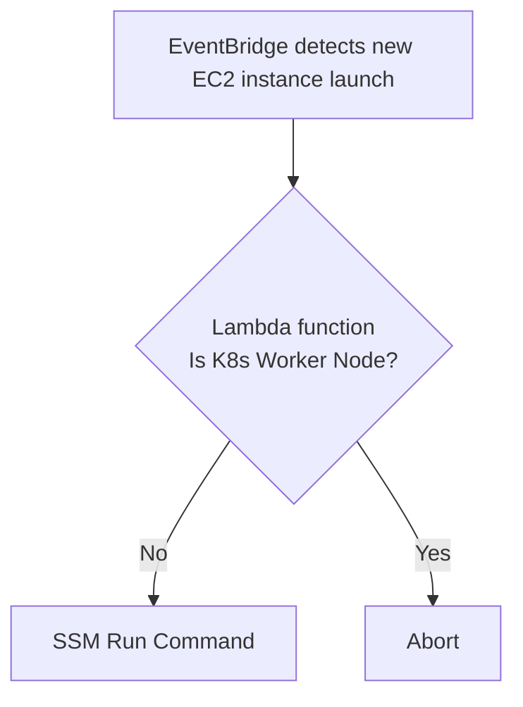

# FED-603: RA-2 - Setup and install Crowdstrike EDR for EC2 instances (non EKS)


# Overview

The purpose of this solution is to automatically deploy the latest version of the CrowdStrike Falcon Sensor to new EC2 instances in any FedRAMP AWS account using AWS SSM.

# Architecture


As shown in the diagram above, this solution is primarily comprised AWS Services.  The list below shows all of the solution components:

* AWS EventBridge
* AWS Lambda Function
* AWS Systems Managager (SSM)

## High-level Solution Workflow



1. EventBridge is configured to trigger the Lambda function everytime a new EC2 instance is launched.

2. Lambda function will call the SSM Run Command​.

3. SSM Run Command will install the CrowdStrike Falcon Sensor on the new EC2 instance.

# Setup

This section explains any components that require a substantial setup.

## AWS Credential Profiles Setup required by Terraform for multi-account installation of SSM Document

In order for this Terraform module to provision the AWS SSM Document resource on every FedRAMP AWS account a AWS config file needs to be created that works with AWS Identity Center.
At the time this document was written there were ten FedRAMP AWS accounts and the following is the `~/.aws/config` required for these accounts:

```
[default]
sso_session = fedramp-session
region = us-east-1
output = json

[sso-session fedramp-session]
sso_region = us-east-1
sso_start_url = https://d-9067d80a1d.awsapps.com/start
sso_registration_scopes = sso:account:access

[profile fedramp-agencysim-npri]
sso_session = fedramp-session
sso_account_id = 438979369891
sso_role_name = AdministratorAccess
region = us-east-1
output = json

[profile fedramp-edge-nw-npr]
sso_session = fedramp-session
sso_account_id = 491085412189
sso_role_name = AdministratorAccess
region = us-east-1
output = json

[profile fedramp-edge-nw-npri]
sso_session = fedramp-session
sso_account_id = 761018876945
sso_role_name = AdministratorAccess
region = us-east-1
output = json

[profile fedramp-edge-nw-prd]
sso_session = fedramp-session
sso_account_id = 120569617426
sso_role_name = AdministratorAccess
region = us-east-1
output = json

[profile fedramp-integration-npr]
sso_session = fedramp-session
sso_account_id = 686255941416
sso_role_name = AdministratorAccess
region = us-east-1
output = json

[profile fedramp-integration-npri]
sso_session = fedramp-session
sso_account_id = 311141548321
sso_role_name = AdministratorAccess
region = us-east-1
output = json

[profile fedramp-integration-prd]
sso_session = fedramp-session
sso_account_id = 528757785295
sso_role_name = AdministratorAccess
region = us-east-1
output = json

[profile fedramp-k8s-npr]
sso_session = fedramp-session
sso_account_id = 054037137415
sso_role_name = AdministratorAccess
region = us-east-1
output = json

[profile fedramp-k8s-npri]
sso_session = fedramp-session
sso_account_id = 202533508444
sso_role_name = AdministratorAccess
region = us-east-1
output = json

[profile fedramp-k8s-prd]
sso_session = fedramp-session
sso_account_id = 816069130447
sso_role_name = AdministratorAccess
region = us-east-1
output = json

[profile fedramp-network]
sso_session = fedramp-session
sso_account_id = 445567083790
sso_role_name = AdministratorAccess
region = us-east-1
output = json

[profile fedramp-security]
sso_session = fedramp-session
sso_account_id = 980921753767
sso_role_name = AdministratorAccess
region = us-east-1
output = json

[profile fedramp-tools-npri]
sso_session = fedramp-session
sso_account_id = 897722679597
sso_role_name = AdministratorAccess
region = us-east-1
output = json

[profile fedramp-tools-prd]
sso_session = fedramp-session
sso_account_id = 195665324256
sso_role_name = AdministratorAccess
region = us-east-1
output = json

[profile fedramp-main]
sso_session = fedramp-session
sso_account_id = 418295679780
sso_role_name = SecurityAudit
region = us-east-1
output = json
```

## Steps to authenticate to AWS Identity Center

1.  Run this command from Linux CLI

```
aws sso login --sso-session fedramp-session --use-device-code
```

2. It will output a URL that you need to put into you browser.  Something like:

```
https://d-9067d80a1d.awsapps.com/start/#/device?user_code=ZWSV-FKLQ
```

3.  Your browser should output something like this:


At this point you should be able to run an AWS CLI command on any of the FedRAMP AWS accounts.  For example:

```
aws s3 ls --profile fedramp-tools
```

The profile must match one of the the profile values in the AWS config file above.

## Infrastructure as Code (IaC) Deployment

This entire solution was provisioned to AWS using Terraform.

## Steps to provision solution on AWS

1. Install Terraform onto the same computer where you have setup the AWS Credential Profiles described above
2. Clone this repository
3. Run the following Terraform commands:
```
terraform init
terraform validate
terraform plan
terraform apply --auto-approve
```

## Lambda Function

The Lambda function is built from Python code.

### How does the Lambda Function tell SSM on which EC2 Instances to install which Agent version?

The Lambda function gets the EC2 Instance Id of the newly launched EC2 Instance from the Event Bridge payload using this statement:

```
instance_id = event["detail"]["instance-id"]
```

## Systems Manager (SSM)

In the Terraform ssm module of this project Linux and Windows SSM Documents are defined that contain the logic to install the CrowdStrike Falcon Sensor on the new EC2 instance.  The code snippets below show the Linux and Windows SSM Documents.

### Linux SSM Document

```json
{
  "description": "Install CrowdStrike Falcon Sensor on Linux.",
  "mainSteps": [
    {
      "action": "aws:runShellScript",
      "inputs": {
        "runCommand": [
          "set -e",
          "INSTALL_SCRIPT_URL='https://raw.githubusercontent.com/crowdstrike/falcon-scripts/v1.7.4/bash/install/falcon-linux-install.sh'",
          "export FALCON_CLOUD=us-gov-1",
          "export FALCON_CLIENT_ID='{{ falconClientId }}'",
          "export FALCON_CLIENT_SECRET='{{ falconClientSecret }}'",
          "curl -L \"$INSTALL_SCRIPT_URL\" | bash",
          "set +e"
        ]
      },
      "name": "FalconSensorInstallation",
      "precondition": {
        "StringEquals": [
          "platformType",
          "Linux"
        ]
      }
    }
  ],
  "parameters": {
    "falconClientId": {
      "description": "(Required) CrowdStrike Falcon Client Id",
      "type": "String"
    },
    "falconClientSecret": {
      "description": "(Required) CrowdStrike Falcon Secret",
      "type": "String"
    }
  },
  "schemaVersion": "2.2"
}
```

### Windows SSM Document

```json
{
  "description": "Install CrowdStrike Falcon Sensor on Windows",
  "mainSteps": [
    {
      "action": "aws:runPowerShellScript",
      "inputs": {
        "runCommand": [
          "$ErrorActionPreference = 'Stop'",
          "$ProgressPreference = 'SilentlyContinue'",
          "",
          "# 1. Download installer script",
          "$installScriptPath = Join-Path $env:TEMP 'falcon_windows_install.ps1'",
          "Invoke-WebRequest -Uri 'https://raw.githubusercontent.com/crowdstrike/falcon-scripts/v1.7.4/powershell/install/falcon_windows_install.ps1' -OutFile $installScriptPath -UseBasicParsing",
          "",
          "# 2. Install sensor directly with credentials",
          "& $installScriptPath -FalconCloud us-gov-1 -FalconClientId '{{ falconClientId }}' -FalconClientSecret '{{ falconClientSecret }}' -ErrorAction Stop",
          "",
          "# 3. Verify installation and service status",
          "$service = Get-Service -Name CSAgent -ErrorAction SilentlyContinue",
          "if (-not $service -or $service.Status -ne 'Running') {",
          "    Write-Error 'CSAgent service not found or not running'",
          "    exit 1",
          "}"
        ],
        "timeoutSeconds": 3600
      },
      "name": "FalconSensorInstallation",
      "precondition": {
        "StringEquals": [
          "platformType",
          "Windows"
        ]
      }
    }
  ],
  "parameters": {
    "falconClientId": {
      "description": "(Required) CrowdStrike Falcon Client Id",
      "type": "String"
    },
    "falconClientSecret": {
      "description": "(Required) CrowdStrike Falcon Secret",
      "type": "String"
    }
  },
  "schemaVersion": "2.2"
}
```

The SSM Run Command uses this SSM Document to install the CrowdStrike Falcon Sensor on the new EC2 instance and record what it has done in the Run Command history.

# Testing

Once this solution is deployed it can be tested from the AWS Lambda console by going to the `trigger-ssm-lambda` Lambda function and using the native **Test** functionality.

# Helpful commands
